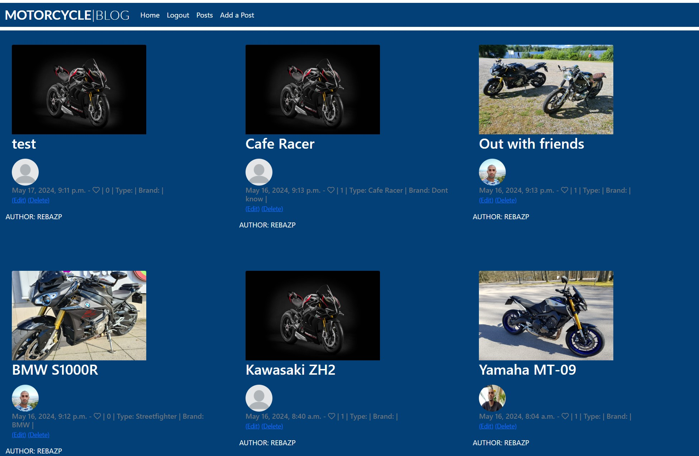
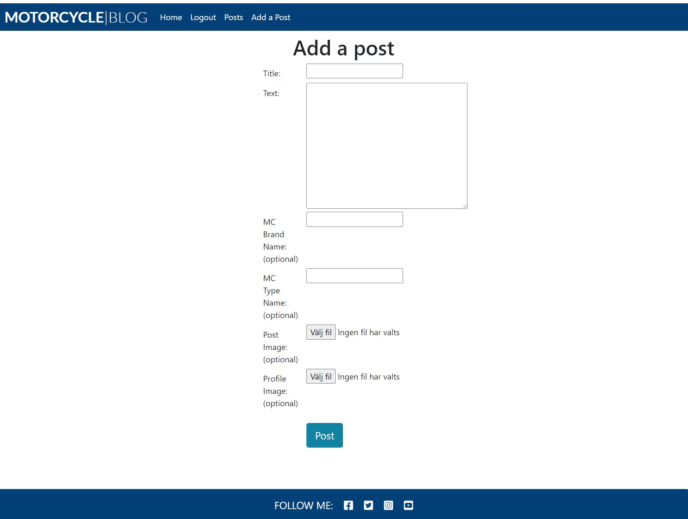
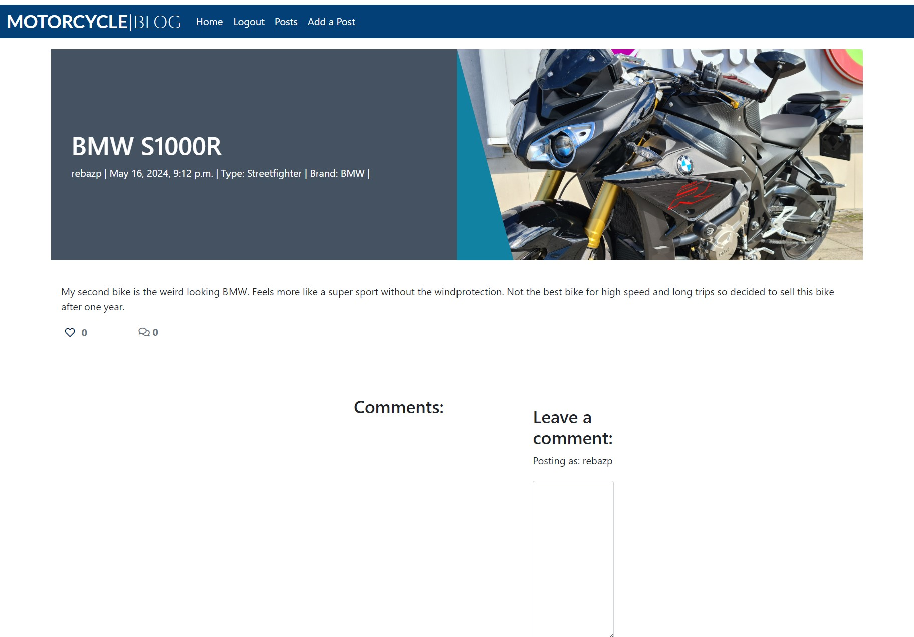
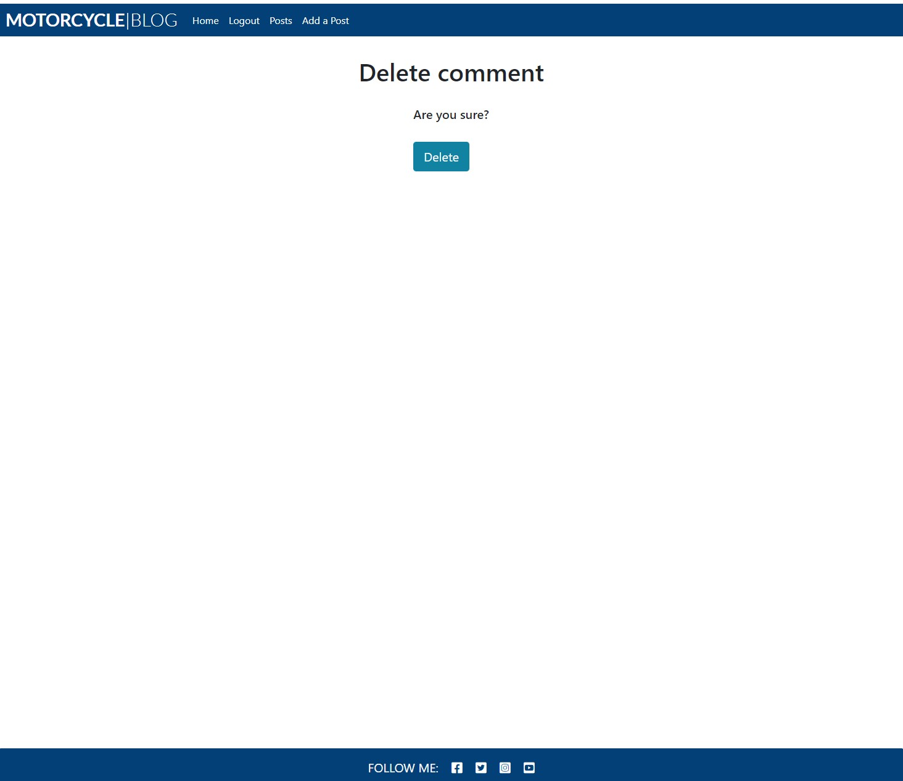

# Rebaz Motorcycle Blog

Join Rebaz and his passion for motorcycles in this amazing blog where he and his users share stories and pictures related to motorcycles. 
This Django based blog allows users to create their own account so that they can leave blog posts, comments and likes. 
This simple and easy to use blog is for the creator and users to share memories.

[View Rebaz Motorcycle Blog Live Website Here](https://mcblog-ee5e41319303.herokuapp.com/)
---

## Table of Contents
### [User Experience](#user-experience-ux)
* [Project Goals](#project-goals)
* [Agile Methodology](#agile-methodology)
* [Target Audience](#target-audience)
* [First time user](#first-time-user)
* [Registered user](#registered-user)
* [Admin user](#admin-user)
### [Design](#design-1)
* [Color Scheme](#color-scheme)
* [Images](#images)
* [Database Scheme](#database-scheme)
* [Data Models](#data-models)
* [User Journey](#user-journey)
### [Security Features](#security-features-1)
* [User Authentication](#user-authentication)
* [Login Decorator](#login-decorator)
* [CSRF Protection](#csrf-protection)
### [Features](#features-1)
* [Existing Features](#existing-features)
* [Features Left to Implement](#features-left-to-implement)
### [Technologies Used](#technologies-used-1)
* [Languages Used](#languages-used)
* [Databases Used](#databases-used)
* [Frameworks Used](#frameworks-used)
* [Programs Used](#programs-used)
* [Installed Packages](#installed-packages)
### [Deployment and Local developement](#deployment-and-local-developement-1)
* [Local Developement](#local-developement)
* [ElephantSQL Database](#elephantsql-database)
* [Cloudinary](#cloudinary)
* [Heroku Deployment](#heroku-deployment)
### [Testing](#testing-1)
### [References](#references-1)
* [Docs](#docs)
* [Content](#content)
* [Acknowledgments](#acknowledgments)
---

## User Experience (UX)

Join Rebaz in this blog where he share motorcycle pictures and memories with the users. The user experience is simple and easy to use for all ages. A place where everyone can share their 
passion for motorcycles and adventures.

### Project Goals

The goal with this project is to share motorcycle pictures and memories through text and pictures. Engage with readers through creating blog posts and comments. Also give the ability for users to comment and like posts.

### Agile Methodology

Agile Methodology was used to help prioritize and organize tasks, writing the user stories and using project boards on github. Template was created to help write user stories and epics.

* Epics were written containing possible user stories and based on that the blog was made.
* User stories were created by looking at epics and through iterations the project was advancing.
* Project board is set to public.
* Project board was used to track progression of the task through the todo, in progress and done columns.
* Labels were added to sort the issues based on the importance.

 Epic Template

 User Stories Template

 User Stories, Issues

 Project Board

#### Epics
1. User interaction with posts
2. User engagement with content
3. Account management
4. Content creation and management
5. Deployment

#### User Stories
1. View post list
* Given more than one post in the database, these multiple posts are listed
* When a user opens the main page a list of posts is seen
* Then the user sees all post titles with pagination to choose what to read
2. Open a post
* When a blog post title is clicked a detailed view of the post is seen
3. View comments
* Given one or more comments the user and admin can view them
* A site user can click on the comment thread to read the conversation
4. Account registration
* Given an username and password a user can register an account
* The user can log in
* When the user is logged in they can add post and comment posts
5. Comment on post
* User can comment on posts
* User can reply the comments
6. Modify and delete comment on a post
* A logged in user can modify and delete their comment
7. Manage posts
* Admin and users can create, read, update and delete blog posts
8. Likes
* User can view likes on posts
* User can add like and unlike to posts
9. Author image
* Author image is visible in the post
10. Finish Readme and Testing
* User can view the completed readme from github repo
* User can view the completed testing from github repo
11. Deployment
* Finish the blog and deploy to Heroku

Detailed look can be found in the [Project Board](https://github.com/users/rebazp/projects/8/views/1)

### Target Audience

* People seeking to connect with other motorcyclists.
* People seeking to share motorcycle memories and pictures.

### First Time User

* Simple and intuitive blog with easy navigation.
* Easy Registration process.
* Simple to use on any device.

### Registered User

* Seamless login process with a secure and personalized user account.
* Browsing through posts and see related comments.
* Give comments and likes.
* Option to log out.

### Admin User

* Secure and separate login portal for admin users with appropriate access control.
* Access to an admin dashboard for managing users, posts and comments
* Ability to add, edit, or delete user, posts and comments.

## Design

The blog is easy to read and navigate through. The navbar contains the links to guide the user through the blog. The footer is visible and connects the user to social media.

### Color Scheme

[coolors.co](https://coolors.co/0a1128-001f54-034078-1282a2-fefcfb)

### Images

All images used in these blog posts are my own.

### Database Scheme

### Data Models

1. AllAuth User Model
    * Django Allauth, the User model is the default user model provided by the Django authentication system.
    * The User entity has a many-to-many relationship with the blog posts. This means that a User can have many blog posts and interact with other blog posts through likes, comments, edits, deletes etc.
---
3. Post Model
    * As a user you can create blog posts.
    * Admin can add, delete and update posts through djangos admin panel.
    * Only Admin can change the data in the backend.
    * User can see the posts created by other users.
    * Tools to be used in posts are: title, body, slug, author, featured-image, author-image, excert, brand-name, type-name, updated-on, created-on, status, likes and id.
    * Full CRUD functionality is available to the user.
---
4. Comment Model
    * As a user you can create blog comments.
    * Admin can add, delete and update comments through djangos admin panel.
    * Only Admin can change the data in the backend.
    * Tools to be used in comments are: post, name, user, email, body, created-on, approved and id.
    * Full CRUD functionality is available to the user.

### User Journey 

## Security Features

### User Authentication

* Django Allauth is a popular authentication and authorization library for Django, which provides a set of features for managing user authentication, registration, and account management.

### Login Decorator

* add_category, add_comment, add_post, article_details, delete_post and update_post: These views allows user to interact with the blog and requires user authentication.
* This ensures that only authenticated users can access these views.

### CSRF Protection

* Django provides built-in protection against Cross-Site Request Forgery (CSRF) attacks. CSRF tokens are generated for each user session, and they are required to submit forms or perform state-changing actions. When a user logs out, the session and associated CSRF token are invalidated, making it difficult for an attacker to forge a valid request using a copied URL.

## Features

* Home page with a short introduction of the blog and a picture taken by Rebaz of his current bike.
* Blog posts page with the most recent blog posts.
* Navigation bar and footer.
* User can make an account, login and and logout.
* When logged in, users can add post and comments.
* Users can edit and delete their posts and comments.
* User can like blog posts.

### Existing Features

* Home page
    * Displays a navigation bar at the top, introduction in the center and footer at the bottom.

* Once logged in the Logout, Posts and Add a Post links appear in the navbar.

* Register
    * User can create an account.

* Login
    * User can login into an account, if they have created one.

* Posts
    * User can view posts when logged in.

* Add blog post
    * Users can create blog post by clicking on the add a post button.
    * Form validation is implemented to make sure form are submitted correctly and if there is an error user will be notified with alert message.
    * When user creates blog post they get redirected to post page.

* Edit blog post
    * Users can edit blog post they created by pressing on the edit button.
    * When user edit blog post they get redirected to post page.

* Delete blog post
    * Users can delete a blog post they created by pressing on the delete button.
    * When user delete blog post they get redirected to post page.

* View blog post
    * When user press on a blog post they can see the content of the blog post, comments and likes. The user can leave comments and delete or edit their own comments.
    

* Delete comment
    * Users can delete a blog comment they created by pressing on the delete button.
    * When user delete blog comment they get redirected to post page.

* Edit comment
    * Users can edit a blog comment they created by pressing on the edit button.
    * When user edit blog comment they get redirected to post page.

* Like & comment blog post
    * User can like a blog post and see total likes.
    * When user have pressed the button the total likes changes.
    * User can comment a blog post and see total comments.
    * When user have commented a blog post the total comments changes.

* Logout
    * User can logout from their account.

* Admin Features
    * Django built in admin panel allows admin control over the website.
    * Admin can access admin panel through his navigation bar.
    * Can add, update, delete user, post, comment, like and groups.

#### CRUD Confirmation Logged In
Confirmation message appears when the user has succefully logged in. 

#### CRUD Confirmation Logged Out
Confirmation message appears when the user has succefully logged out. 

#### CRUD Confirmation Post Added
Confirmation message appears when the user has succefully added a post. 

#### CRUD Confirmation Post Edited
Confirmation message appears when the user has succefully edited a post. 

#### CRUD Confirmation Comment Added
Confirmation message appears when the user has succefully added a comment. 

#### CRUD Confirmation Comment Edited
Confirmation message appears when the user has succefully edited a comment. 

### Features Left to Implement 

* Implement search functionality, enabling users to search for posts based on blog post content.

* Implement CRUD alert for deleting post and comment.

## Technologies Used

### Languages Used

* [HTML5](https://en.wikipedia.org/wiki/HTML5)
* [CSS3](https://en.wikipedia.org/wiki/CSS)
* [JavaScript](https://en.wikipedia.org/wiki/JavaScript)
* [Python](https://en.wikipedia.org/wiki/Python_(programming_language))

### Databases Used

* [ElephantSQL](https://www.elephantsql.com/) - Postgres database.
* [Cloudinary](https://cloudinary.com/) - Online static file storage.

### Frameworks Used

* [Django](https://www.djangoproject.com/) - Python framework.
* [Bootstrap 5.3](https://getbootstrap.com/docs/5.3/getting-started/introduction/) - CSS framework.

### Programs Used

* [Github](https://github.com/) - Storing the code online.
* [Gitpod](https://www.gitpod.io/) - To write the code.
* [Heroku](https://www.heroku.com/) - Used as the cloud-based platform to deploy the site.
* [Google Fonts](https://fonts.google.com/) - Import main font the website.
* [Moqups](https://moqups.com/) - Used to create wireframes and schemes.
* [Am I Responsive](https://ui.dev/amiresponsive) - To show the website image on a range of devices.
* [Git](https://git-scm.com/) - Version control.
* [JSHint](https://jshint.com/) - Used to validate JavaScript.
* [W3C Markup Validation Service](https://validator.w3.org/) - Used to validate HTML.
* [CSS Validation Service](https://jigsaw.w3.org/css-validator/) - Used to validate CSS.
* [CI Python Linter](https://pep8ci.herokuapp.com/#) - Used to validate Python.

### Installed Packages
- asgiref==3.8.1
- cloudinary==1.40.0
- crispy-bootstrap5==2024.2
- dj-database-url==0.5.0
- dj3-cloudinary-storage==0.0.6
- Django==5.0.6
- django-allauth==0.62.1
- django-crispy-forms==2.1
- django-summernote==0.8.20.0
- gunicorn==22.0.0
- psycopg2==2.9.9
- pytz==2024.1
- sqlparse==0.5.0

## Deployment and Local Developement

Live deployment can be found on this [View Rebaz Motorcycle Blog Live Website Here](https://mcblog-ee5e41319303.herokuapp.com/)

### Local Developement

#### How to Fork
1. Log in(or Sign Up) to Github.
2. Go to repository for this project [Motorcycle Blog](https://github.com/rebazp/P4MotorcycleBlog)
3. Click the fork button in the top right corner.

#### How to Clone
1. Log in(or Sign Up) to Github
2. Go to repository for this project [Motorcycle Blog](https://github.com/rebazp/P4MotorcycleBlog)
3. Click on the code button, select whether you would like to clone with HTTPS, SSH or GitHub CLI and copy the link shown.
4. Open the terminal in your code editor and change the current working directory to the location you want to use for the cloned directory.
5. Type the following command in the terminal (after the git clone you will need to paste the link you copied in step 3 above)
6. Set up a virtual environment (this step is not required if you are using the Code Institute Template in GitPod as this will already be set up for you).
7. Install the packages from the requirements.txt file - run Command pip3 install -r requirements.txt

### ElephantSQL Database
[Motorcycle Blog](https://github.com/rebazp/P4MotorcycleBlog) is using [ElephantSQL](https://www.elephantsql.com/) PostgreSQL Database

1. Click Create New Instance to start a new database.
2. Provide a name.
3. Select the Tiny Turtle (Free) plan.
4. You can leave the Tags blank.
5. Select the Region and Data Center closest to you.
6. Once created, click on the new database name, where you can view the database URL and Password.

### Cloudinary
[Motorcycle Blog](https://github.com/rebazp/P4MotorcycleBlog) is using [Cloudinary](https://cloudinary.com/)
1. For Primary interest, you can choose Programmable Media for image and video API.
2. Optional: edit your assigned cloud name to something more memorable.
3. On your Cloudinary Dashboard, you can copy your API Environment Variable.
4. Be sure to remove the CLOUDINARY_URL= as part of the API value; this is the key.

### Heroku Deployment
* Log into [Heroku](https://www.heroku.com/) account or create an account.
* Click the "New" button at the top right corner and select "Create New App".
* Enter a unique application name.
* Select your region.
* Click "Create App".

#### Prepare enviroment and settings.py
* In your GitPod workspace, create an env.py file in the main directory.
* Add the DATABASE_URL value and your chosen SECRET_KEY value to the env.py file.
* Update the settings.py file to import the env.py file and add the SECRETKEY and DATABASE_URL file paths.
* Comment out the default database configuration.
* Save all files and make migrations.
* Add the Cloudinary URL to env.py
* Add the Cloudinary libraries to the list of installed apps.
* Add the STATIC files settings - the url, storage path, directory path, root path, media url and default file storage path.
* Link the file to the templates directory in Heroku.
* Change the templates directory to TEMPLATES_DIR.
* Add Heroku to the ALLOWED_HOSTS list the format ['app_name.heroku.com', 'localhost'].

#### Add the following Config Vars in Heroku:

* CLOUDINARY_URL - Insert your own Cloudinary API key.
* DATABASE_URL - Insert your own ElephantSQL database URL here.
* DISABLE_COLLECTSTATIC = 1 - this is temporary, and can be removed for the final deployment.
* SECRET_KEY - This can be any Django random secret key.

#### Heroku needs two additional files to deploy properly

* Requirements.txt
* Procfile

#### Deploy

1. Make sure DEBUG = False in the settings.py.
2. Go to the deploy tab on Heroku and connect to GitHub, then to the required repository.
3. Scroll to the bottom of the deploy page and either click Enable Automatic Deploys for automatic deploys or Deploy Branch to deploy manually. Manually deployed branches will need re-deploying each time the GitHub repository is updated.
4. Click 'Open App' to view the deployed live site.

Site is now live

## Testing
Please see  [TESTING.md](TESTING.md) for all the detailed testing performed.

## References
For thhis project I have had inspiration from the Code Institute example project, I think therefore i blog and tutorials from Youtube. Most part of the code that I've used in this project is my own, which I have learned during my time studying at Code Institute.

* Code Institute project 4 [I Think Therefore I Blog](https://learn.codeinstitute.net/courses/course-v1:CodeInstitute+FSD101_WTS+2023_Q3/courseware/56a2da0940b4411d8a38c2b093a22c60/4565659a34d648b8b8edd063c3182180/)
* Youtube series Django Tutorial by [Net Ninja](https://www.youtube.com/watch?v=n-FTlQ7Djqc&list=PL4cUxeGkcC9ib4HsrXEYpQnTOTZE1x0uc&index=1&ab_channel=NetNinja)
* Youtube series Python Django Tutorial by [Corey Schafer](https://www.youtube.com/watch?v=UmljXZIypDc&list=PL-osiE80TeTtoQCKZ03TU5fNfx2UY6U4p&index=1&ab_channel=CoreySchafer)
* Yoube Python Django Web Framework by [FreeCodeCamp](https://www.youtube.com/watch?v=F5mRW0jo-U4&ab_channel=freeCodeCamp.org)

### Docs
I have utilized many websites for this project and this is some of them.

* [W3 Schools](https://www.w3schools.com)
* [Stack Overflow](https://stackoverflow.com/)
* [Python Django Web Framework](https://www.djangoproject.com/start/overview/)
* [Code Institute](https://learn.codeinstitute.net/dashboard)
* [Bootstrap 5.3](https://getbootstrap.com/docs/5.3/getting-started/introduction/)
* [Django docs](https://docs.djangoproject.com/en/4.2/contents/)
* [Django Allauth](https://django-allauth.readthedocs.io/en/latest/)
* [Django and Static Assets](https://devcenter.heroku.com/articles/django-assets)
* [Cloudinary](https://cloudinary.com/documentation/diagnosing_error_codes_tutorial)
* [Google](https://www.google.com/)
* [Youtube](https://www.youtube.com)

### Content

* All of the content is imaginary and written by the developer, Rebaz Pappiland.
* All images were taken by Rebaz. Default image for post and profile were taken from Google.

### Acknowledgments

* I would like to thank the tutors at Code Institute for their help.
* I would like to thank Thomas Tomo for his amazing README which gave me inspiration for mine.
* I would also like to extend my appreciation to the Slack community for their continuous engagement and willingness to share knowledge and help me through my projects, especially Tomas K. The collaborative environment provided a platform for learning, troubleshooting, and gaining inspiration from fellow developers.
* My mentor Rohit Sharma for his knowledge and guidance.