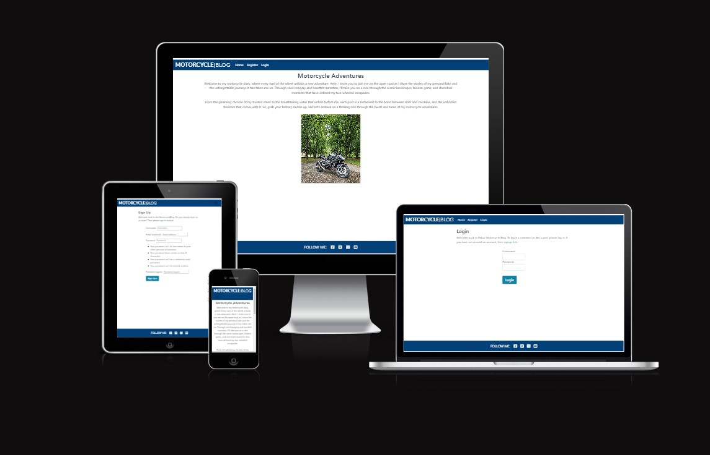
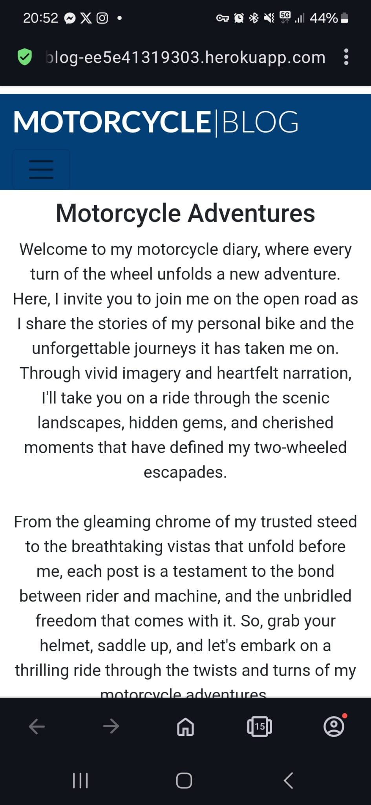
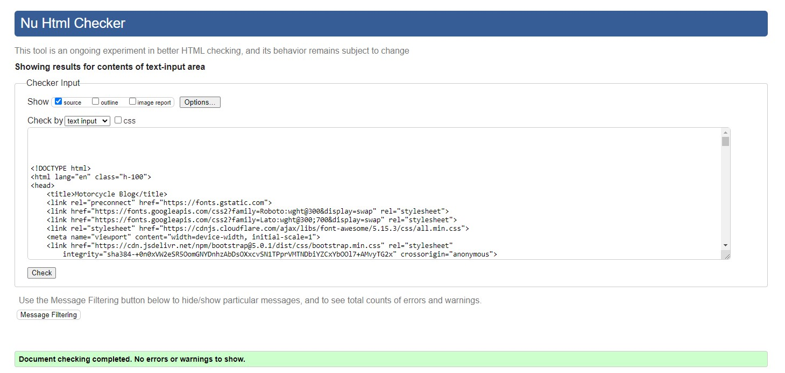

# Motorcycle Blog | Testing

Return to [README](README.md)
- - -
All testing for this project was conducted manually both during and after development. The anticipated outcomes of button clicks and feature tests are documented in this Testing.md file. This involved manually clicking buttons and links, and verifying that all functions performed as intended. All project functions are operational.

Django, a Python framework, was primarily used, with JavaScript handling the alert messages. These messages function correctly. Currently, Motorcycle Blog has no social media presence, so the links direct to their respective homepages.

As the project was developed using Bootstrap, it is fully responsive across all screen sizes.

## Table of Contents
* [Responsiveness Testing](#responsiveness-testing)
* [Browser Compatibility Testing](#browser-compatibility-testing)
* [Device Testing](#device-testing)
* [Code Validation](#code-validation)
* [HTML Validation](#html-validation)
* [CSS Testing](#css-testing)
* [Lighthouse Report](#lighthouse-report)
* [Bugs](#bugs)
* [Resolved Bugs](#resolved-bugs)
* [Unresolved Bugs](#unresolved-bugs)
* [Features Testing](#features-testing)

## Responsiveness Testing

* The deployed website underwent rigorous testing on multiple devices and screen sizes to ensure its responsiveness and adaptability. Developer Tools were utilized to simulate various screen sizes, enabling thorough examination of how the website behaves across different devices. Bootstrap classes and media queries were implemented to achieve the desired design, ensuring that the website maintains its visual and functional integrity on all platforms, enhancing the user experience.

## Browser Compatibility Testing

* The project was tested on multiple web browsers to check for compatibility issues and ensure it functions as expected across all of them. This testing process guarantees a smooth and consistent user experience, regardless of the browser used.

 Chrome

 Microsoft Edge

 Opera

 Firefox

 Samsung Internet (Mobile)

## Device Testing

* Device testing was conducted on a variety of phone models, including Samsung Galaxy, iPhone and Sony. The assistance of family members and friends was sought to perform the testing. This comprehensive approach ensured that the website was thoroughly evaluated on different devices and platforms, contributing to a more robust and user-friendly final product.

## Code Validation

### HTML Validation

 Home Page

 Register Page

- Since I'am using templates I cannot fix these errors.

 Login Page

 Logout Page

 Add Post Page

 View Posts Page

 View Posts Detail Page

 Edit Post Page

 Delete Post Page

 Edit Comment Page

 Delete Comment Page

 404 Error Page

 500 Error Page

- Since I'am using templates with django I cannot fix these errors.

### CSS Testing

Testing with <https://jigsaw.w3.org/css-validator/> show no errors in CSS:

## Lighthouse Report

 Home Page

 Register Page

 Login Page

 Logout Page

 Add Post Page

 View Posts Page

 View Posts Detail Page

 Edit Post Page

 Delete Post Page

 Edit Comment Page

 Delete Comment Page

 404 Error Page

 500 Error Page

## Bugs

### Resolved Bugs

#### Remove Admin Approval

* When deleting a post or comment I didn't want the admins approval. I had some issues with the migrations not working properly and had to restart my IDE to solve the migration issue and managed to solved the bug.

#### Update Blog Post Text

* When editing the blog post the new text didn't appear for some reason. After asking the slack community I got the tip to check my models. I solved the bug by changing the post models and deleted the content function and kept body.

### Unresolved Bugs

* There are no unresolved bugs.

## Features Testing

